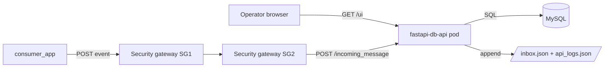
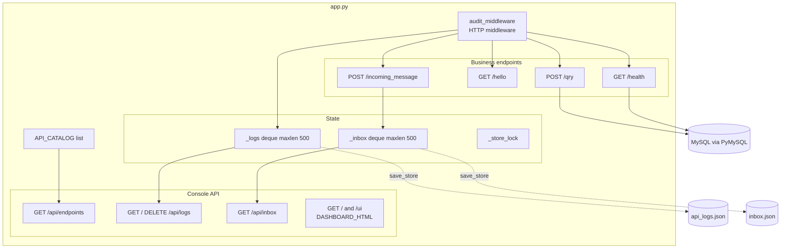
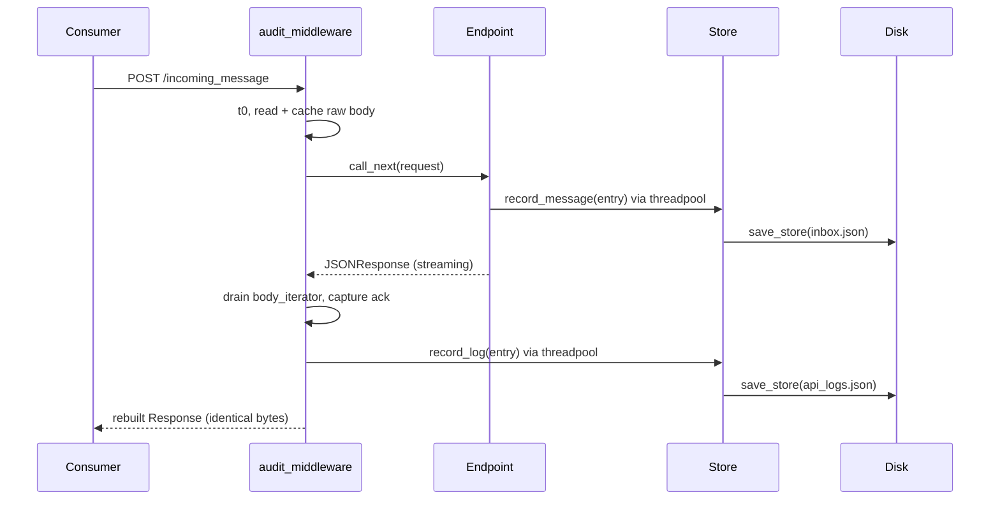
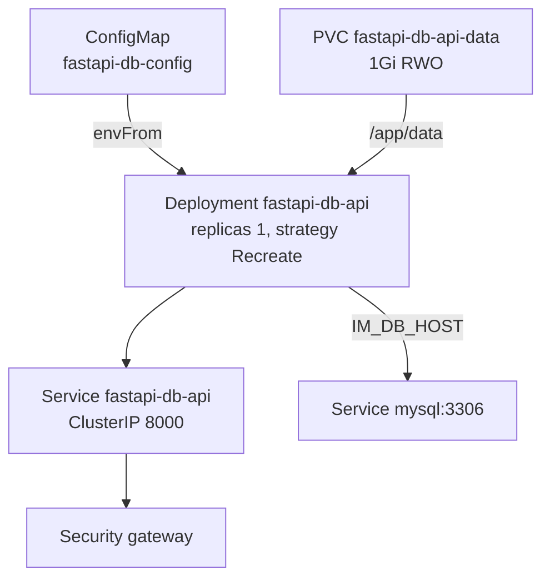

# Architecture

Application: **Simple FastAPI Database API** v2.0
Role: **provider** application behind the Information Mediator security gateway
Source: [`app.py`](../app.py) (single module), [`test_app.yaml`](../test_app.yaml), [`dockerfile`](../dockerfile)

---

## 1. Context

The app is one of several workloads in the Information Mediator cluster. Consumers
do not call it directly: they publish through their own security gateway, which
forwards the call to this provider's gateway and on to the pod.



Because the gateway is an intermediary, the pod sees the gateway's socket address
as the peer. The real origin is recovered from the `X-Forwarded-For` header —
see [`caller_of()`](../app.py).

---

## 2. Internal structure

Everything lives in one module. The dashboard is a Python string constant rather
than a static file so that the container image stays a single `COPY app.py`.



### Layers

| Layer | Elements | Responsibility |
|---|---|---|
| Transport | `audit_middleware` | Capture request/response pairs, rebuild the response, exclude console traffic |
| Business | `/health`, `/hello`, `/qry`, `/incoming_message` | The provider's actual contract |
| Console API | `/api/endpoints`, `/api/logs`, `/api/inbox` | Read models for the UI, no business logic |
| Presentation | `DASHBOARD_HTML` | Self-contained page: inline CSS + vanilla JS, zero external assets |
| State | `_logs`, `_inbox`, `save_store`, `load_store` | Bounded in-memory buffers mirrored to JSON |
| Persistence | PyMySQL | Only `/qry` and `/health` touch the database |

---

## 3. Request flow

Every non-console request passes through the middleware, which is what makes the
Logs tab possible without instrumenting each endpoint.



Two details matter:

- **The response must be drained and rebuilt.** A `StreamingResponse` body can
  only be consumed once, so the middleware collects the chunks, logs them, then
  constructs a fresh `Response` with the same bytes, status and headers. Skipping
  the rebuild would send an empty body to the caller.
- **The request body is read before `call_next`.** Starlette's `_CachedRequest`
  (0.28+) replays the cached body downstream, so the endpoint still receives it.
  On older Starlette this pattern deadlocks — see [developer.md](developer.md).

Blocking file writes are pushed to the threadpool with `run_in_threadpool` so the
event loop is never blocked by disk I/O.

---

## 4. Data model

### Audit log entry — `api_logs.json`

| Field | Meaning |
|---|---|
| `id` | 12-char trace id |
| `timestamp` | UTC ISO-8601, when the request was received |
| `caller` / `caller_port` | `X-Forwarded-For` first hop, else peer IP |
| `user_agent`, `content_type` | Request headers |
| `method`, `endpoint`, `query_params` | What was called |
| `request_body` | Parsed JSON, or text if unparseable, truncated at `IM_BODY_MAX` |
| `status_code` | Response status |
| `acknowledgement` | The exact response body returned |
| `responded_to` | Who received the acknowledgement |
| `duration_ms` | Server-side latency |

### Inbox entry — `inbox.json`

| Field | Source |
|---|---|
| `message_id` | Generated, 8 hex chars |
| `received_at` | Server UTC clock |
| `sender` | `sender` / `from` / `consumer` → `event.sender` → `X-Sender` → caller IP |
| `event_type` | `eventType` → `event_type` → `type` → `request_type` → `message_type` → `"message"` |
| `request_type` | Duplicate of `event_type`, kept so entries written by v1 still render |
| `room` | `room` → `roomId` → `IM_DEFAULT_ROOM` |
| `event` | The `event` object verbatim |
| `message` | The complete envelope as received |
| `http_method`, `endpoint`, `source_ip`, `content_type`, `user_agent` | Transport metadata |
| `acknowledgement`, `acknowledged_to` | What was returned and to whom |

The expected envelope:

```json
{
  "eventType": "demo-event",
  "event": { "patientId": 42, "status": "admitted" },
  "room": "default-room"
}
```

The parser is deliberately tolerant: unknown shapes are accepted and stored whole
in `message`, so a producer change cannot cause data loss at the receiver.

### Storage strategy

Both stores are `collections.deque(maxlen=N)` — a fixed-size ring buffer, so
memory is bounded no matter how long the pod runs. After each append the whole
buffer is rewritten to disk atomically (`.tmp` + `os.replace`). This is O(n) per
write and only appropriate at this scale; see limitations below.

On startup `load_store` reloads both files, so restarts do not lose history. A
missing or corrupt file is logged and ignored rather than crashing the pod.

---

## 5. Deployment topology



| Decision | Reason |
|---|---|
| `replicas: 1` | State is a local file. Two replicas would each hold a partial log and inbox, and the console would show whichever pod answered. |
| `strategy: Recreate` | The RWO volume can only attach to one node; a rolling update would deadlock waiting for the old pod to release it. |
| PVC rather than `emptyDir` | `emptyDir` survives container restarts but not rescheduling; the inbox is meant to be durable evidence of what was received. |
| Probes on `/health` | The probe opens a real MySQL connection, so a database outage marks the pod NotReady and pulls it out of the Service. |
| `/health` excluded from the log | At `periodSeconds: 10` the kubelet alone would generate ~8,600 entries/day and evict all real traffic from the 500-entry buffer. Set `IM_LOG_HEALTH=true` to include it. |

---

## 6. Configuration

All configuration is environment-based; there is no config file.

| Variable | Default | Purpose |
|---|---|---|
| `IM_DB_HOST` | `127.0.0.1` | MySQL host (`mysql` in-cluster) |
| `IM_DB_PORT` | `3306` | MySQL port |
| `IM_DB_USER` / `IM_DB_PASS` | `root` / `root` | Credentials |
| `IM_DB_NAME` | `ca_db` | Database; empty connects without selecting one |
| `IM_DATA_DIR` | directory of `app.py` | Where the two JSON files live (`/app/data` in the image) |
| `IM_LOG_MAX` | `500` | Audit log ring size |
| `IM_INBOX_MAX` | `500` | Inbox ring size |
| `IM_BODY_MAX` | `8000` | Characters retained per request/response body |
| `IM_LOG_HEALTH` | `false` | Include probe traffic in the log |
| `IM_DEFAULT_ROOM` | `default-room` | Room assigned when an event omits one |

---

## 7. Known issues and limitations

### Open issues

**Reverse-proxy path prefix breaks the console.** The dashboard builds absolute
URLs (`fetch("/api/logs?limit=200")`). Served directly this is correct, but under
a proxy that mounts the app at `/app1/` the browser requests
`http://host:9091/api/logs`, which the proxy does not route — every data call
returns 404 and all three tabs render empty while the page itself loads fine.
The fix is to derive the prefix from `location.pathname` and prepend it to every
request; `root_path` on the `FastAPI()` constructor additionally corrects the
`/docs` and `/openapi.json` URLs. Not yet applied.

**Malformed `image:` key in `test_app.yaml`.** Line 58 reads
`imagemsahique/helloworld_test_k8s_app:v2:` instead of
`image: msahique/helloworld_test_k8s_app:v2`, so the manifest will not apply.

### By design, but worth knowing

- **`/qry` executes arbitrary caller-supplied SQL** with no authentication, no
  statement allow-list, and credentials that default to `root`. Anyone who can
  reach port 8000 can read or drop anything the account can touch. Acceptable for
  a cluster test harness; not for a shared or production environment.
- **The console is unauthenticated** and exposes full request bodies and query
  results to anyone who can reach the pod — a wider surface than the APIs alone.
- **Not horizontally scalable.** State is per-pod; scaling out fragments it.
  Moving `_logs`/`_inbox` to a shared store (a table in the same MySQL, or Redis)
  is the natural next step if more than one replica is ever needed.
- **Whole-file rewrite on every write.** Fine at 500 entries; at 10⁵ it would
  dominate request latency. Append-only JSONL with periodic compaction would be
  the fix.
- **No auth on `DELETE /api/logs`.** Any reachable client can wipe the audit log.
- **Bodies over `IM_BODY_MAX` are stored as truncated text**, not JSON, so very
  large payloads lose their structure in the log (the endpoint still processes
  them in full).
